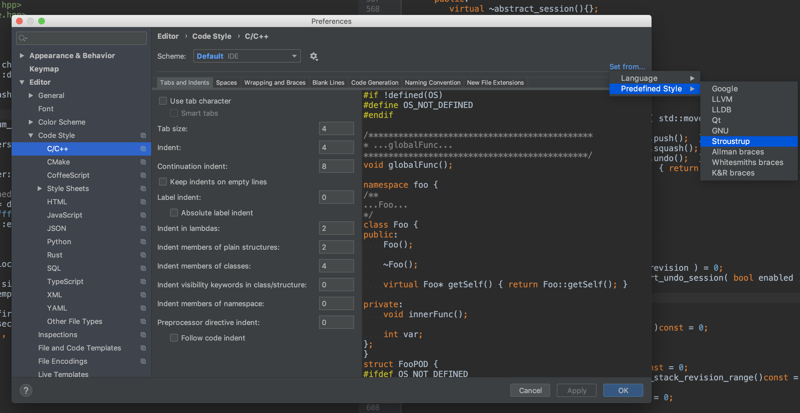

# nodeos-tps
light tps node, can communicate with peer nodeos

1. use TDD to develop
1. follow git flow process
1. code style use core guideline
    https://github.com/isocpp/CppCoreGuidelines/blob/master/CppCoreGuidelines.md  
    and set IDE c++ code style to stroustrup
    
